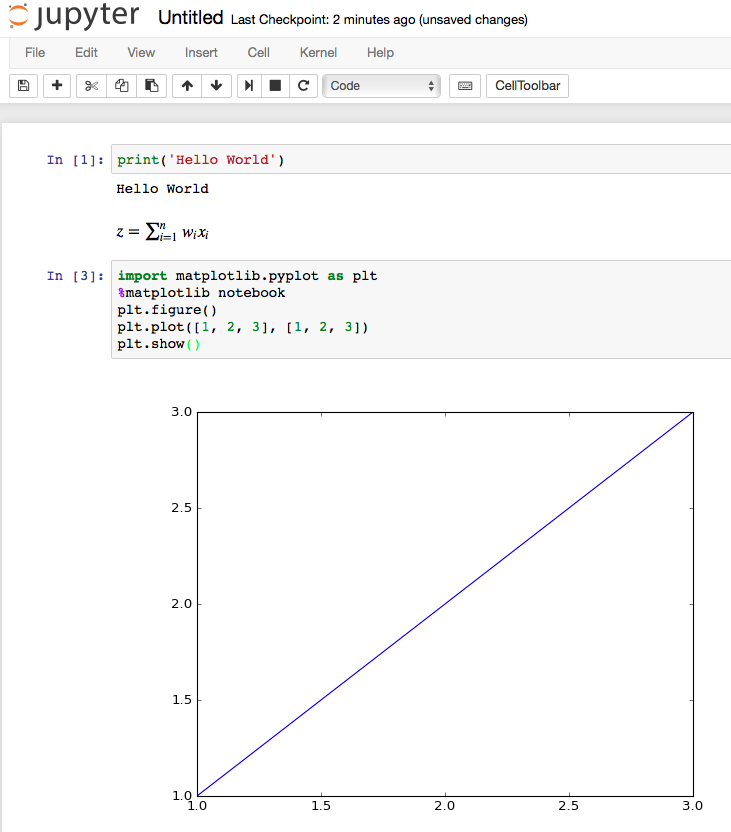

# python-basic
- [ ] 첫 번째 과제.ipynb, 두 번째 과제.ipynb, 세 번째 과제.ipynb를 풀어 주시면 됩니다. 

## Python 패키지 설치

파이썬은 세 가지 주요 운영 체제(Microsoft Windows, macOS, Linux)에서 모두 사용할 수 있으며, 설치 프로그램과 설명서는 공식 파이썬 웹사이트(https://www.python.org)에서 다운로드할 수 있습니다.  

## Python/Jupyter Notebook

**Side Note:**  "IPython Notebook" recently became the "[Jupyter Notebook](<http://jupyter.org>)"; Jupyter is an umbrella project that aims to support other languages in addition to Python including Julia, R, and many more. Don't worry, though, for a Python user, there's only a difference in terminology (we say "Jupyter Notebook" now instead of "IPython Notebook").

Jupyter 노트북은 평소처럼 pip를 통해 설치할 수 있습니다.  

    $ pip install jupyter notebook

또는 Anaconda나 Miniconda가 설치되어 있다면 Conda 설치 프로그램을 사용할 수 있습니다.  

    $ conda install jupyter notebook

Jupyter 노트북을 열려면 코드 예제가 있는 디렉토리로 `cd`를 입력합니다. 예:  

    $ cd ~/code/python-basic

`jupyter notebook`을 실행하여 시작합니다.

    $ jupyter notebook

Jupyter는 기본 브라우저에서 시작합니다(일반적으로 [http://localhost:8888/](http://localhost:8888/)에서 실행). 이제 Jupyter 메뉴에서 열려는 노트북을 간단히 선택할 수 있습니다.  

Jupyter Notebook에 대한 자세한 내용은 [Jupyter 초보자 가이드](http://jupyter-notebook-beginner-guide.readthedocs.org/en/latest/what_is_jupyter.html)와 [Jupyter Notebook 기본 사항](https://jupyter-notebook.readthedocs.io/en/stable/examples/Notebook/Notebook%20Basics.html)을 참조하세요.  

## Jupyter Lab

Jupyter Notebook의 대안인 Jupyter Lab이 2018년에 출시되었습니다. 동일한 `.ipynb` 파일 유형으로 작동하지만 브라우저 인터페이스에서 몇 가지 추가 기능을 제공합니다. Jupyter Notebook을 사용하든 Jupyter Lab을 사용하든 선호도 문제이지만

Jupyter Lab은 다음을 통해 설치할 수 있습니다. 

    $ conda install -c conda-forge jupyterlab
    
Jupyter Notebook을 시작하는 것과 유사하게 다음 명령을 실행할 수 있습니다.  

    $ jupyter lab
    
브라우저에서 Jupyter Lab 세션을 시작하려면 명령줄 터미널에서 다음을 수행합니다. Jupyter Lab 프로젝트에 대한 자세한 내용은 https://jupyterlab.readthedocs.io/en/stable/ 에서 공식 문서를 방문하세요.